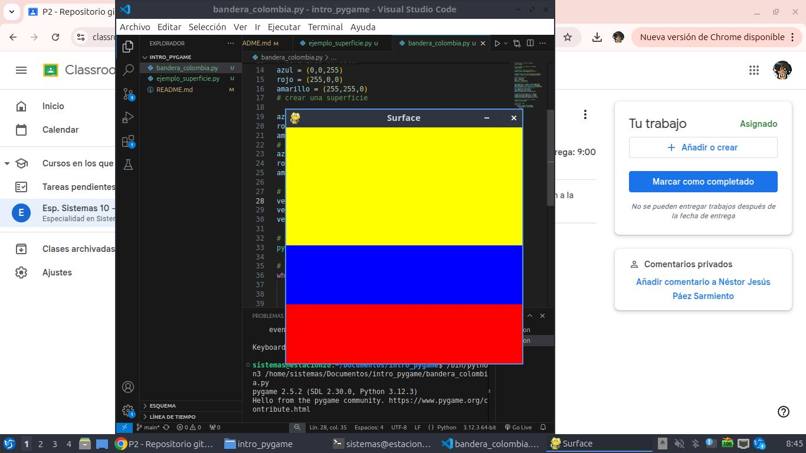

# Estructura de un juego en Pygame

## inicializacion

- Como en todo programa en python, se debe importar los modulos o librerias a utilizar
`import pygame`

- Inicializar pygame usando la funcion init (). Inicializa todos los modulos de pygame importados.
`pygame.init()`

## Visualizacion de la ventana

`ventana = pygame.display.set_mode((600, 400))`

- set_mode() es la funcion encargada de definir el tamaño de la ventana. En el ejemplo se esta definiendo una pantalla de 600 px de ancho, por 400 px de alto.

`pygame.display.set_caption("mi ventana")`

- set_caption es la funcion que añade un titulo a la aventana.

### funcion set_mode()

`set_mode(size =(0,0), flags = 0, depth = 0, display = 0)`

- size = (600,400) define el tamaño de la ventana

- flags: define uno o mas comportamientos para la ventana.
    - Valores:
        - pygame.FULLSCREEN
        - pygame.RESIZABLE
    - Ejemplo:
        - flags = pygame.FULLSCREEN | pygame.
        RESIZABLE: pantalla completa
        dimensiones modificables.

## Bucle del juego - game loop
- Bucle infinito que se interrumpira al cumplir ciertos criterios
- reloj interno del juego
- en cada interaccion del bucle del juego podemos mover un personaje, o tener en cuenta que un objeto a alcanzado a otro, o que se ha cruzado la linea de llegada, lo que quiere decir que la partida ha terminado.- cada iteracion es una oportunidad para actualizar todos los datos relacionados con el estado actual de la partida.
- en cada iteracion se realisan las siguientes tareas:
    1. Comprobar que no se alcanzan las condisiones de parada, en cullo caso se interrumpe el bucle.
    2. Actualizar los recursos necesarios para la iteracion actual.
    3. obtener las entradas del sistema, o de interaccion con el jugador.
    4. Actualizar todas las entidades que caracterizan el juego
    5. refrescar la pantalla

    ## Superficies pygame
    - superficie:
          - Elemento geometrico.
          - Linea, poligono, imagen, texto que se muestra en la pantalla.
          - El poligono se puede o no rellenar de color.
          - Las superficies se crean de diferentes maneras dependiendo del tipo:
            - imagen: image.load()
            - texto: font.render()
            - Superficie generica: pygame.Surface()
            - Ventana del juego: pygamen.display.set.model()

# Diseño de bandera


## gestion del tiempo y los eventos

### Modulo time

- Ofrece varias funciones que permiten cronometrar la sesion actual (desde el init() o pausar), la ejecusion, por ejemplo.
- Funciones
    - pygame.time.get_ticks
    - pygame.time.waitpygame.time.delay

- Ojeto Clock
   - la funcion tick permite actualizar el reloj asociado con el juego actual.
   - Se llama cada vez que se actualiza la pantalla del juego.
   - Permite especificar el numero maximo de fotograma que se muestran por segundo, y por lo tanto, limitar y controlar la velocidad de ejecusion del juego.
   - si insertamos en un bucle de juego la siguiente linea, garantizamos que nunca se ira mas rapido de 58 fotogramas por segundo: `clock.tick(50)`

 ### Gestion de eventos
 - hay diferentes formas para que el programa seppa que se ha desencadenado un evento.
   - es esencial que los programas pueden conocer inmediatamente las acciones del jugador atravez del teclado, el mouse, el joystick o cualquier otro periferico.

   #### Funcion pygame.get
   - permite obtener todos los eventos en espera de ser prosesados y que estan disponibles en unca cola.
   - si no hay ninguno, se obtiene una coleccion vacia.

   ```Python
   # usamos un bucle for para recorrer todos los eventos de la coleccion obtenida de la funcion get.
   for event in pygame.event():
       if event.type == pygame.KEYDOWN:
          if event.key == pygame.K_ESCAPE:
            PARAR_JUEGO = True
   ```
#### Funcio pygame.event.wait
-esta funcion espera a que ocurra un evento,y en cuanto sucede, esta disponible

```Python
while True:
    event = pygame.event.wait()
    if event.type == pygame.QUIT:
        break
```


#### Funcion pygame.event.poll
- Devuelve solo uno de los eventos que estan en la cola de espera
  

## Codigo
```Python
# importamos la libreria pygame
import pygame

# iniciaisamos los modulos de pygame
pygame.init()

# establecer titulo a la ventana
pygame.display.set_caption("Surface")

# Establecemos las direcciones de la ventana
ventana = pygame.display.set_mode((400,400))

# definimos un color
azul = (0,0,255)
rojo = (255,0,0)
amarillo = (255,255,0)
# crear una superficie

azul_superficie = pygame.Surface((400,100))
rojo_superficie = pygame.Surface ((400,100))
amarillo_superficie = pygame.Surface((400,200))
# rellenamos la superficie de azul
azul_superficie.fill((azul))
rojo_superficie.fill((rojo))
amarillo_superficie.fill((amarillo))

# inserto la superficie en la ventana
ventana.blit(azul_superficie, (0,200))
ventana.blit(rojo_superficie, (0,300))
ventana.blit(amarillo_superficie, (0,0))

# actualiza la vision de la ventana
pygame.display.flip()

# Bucle del juego
while True:
    event = pygame.event.wait()
    if event.type == pygame.QUIT:
        break

pygame.quit()`